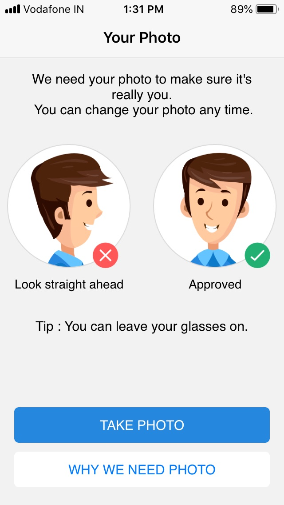
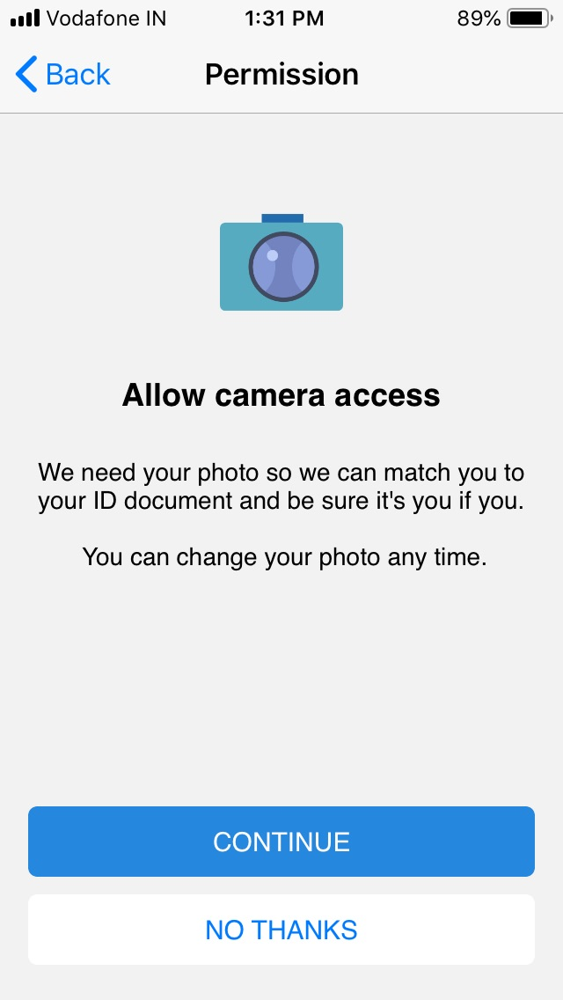
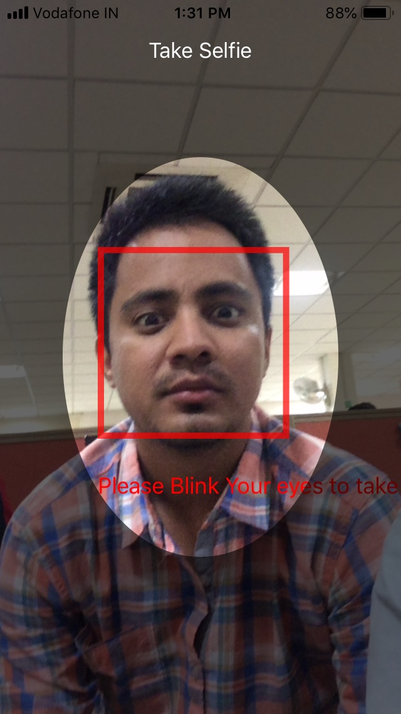
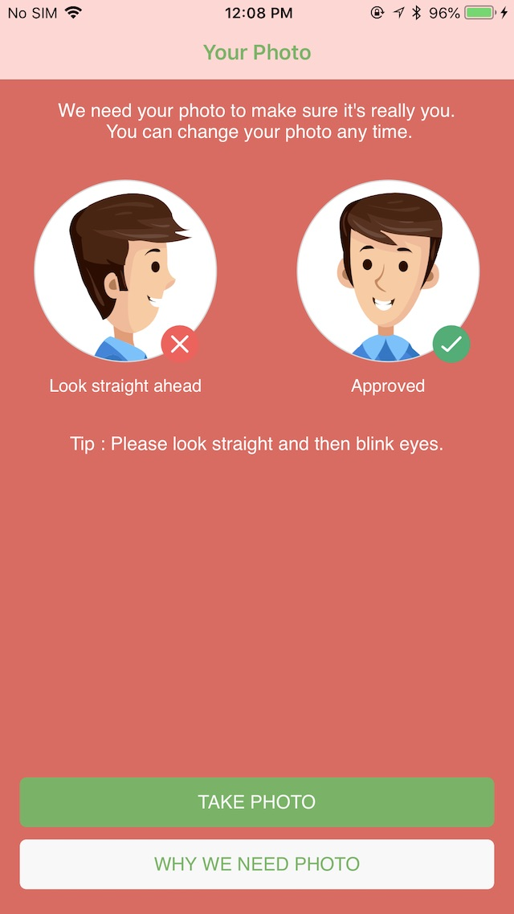
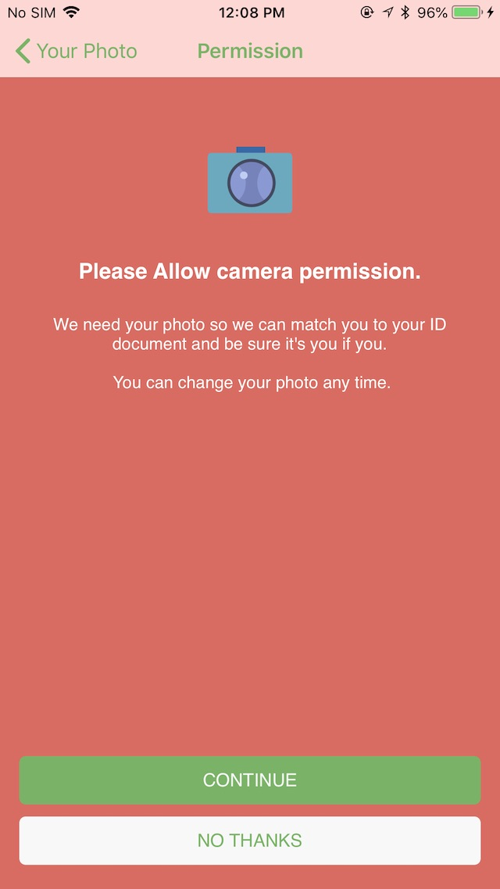
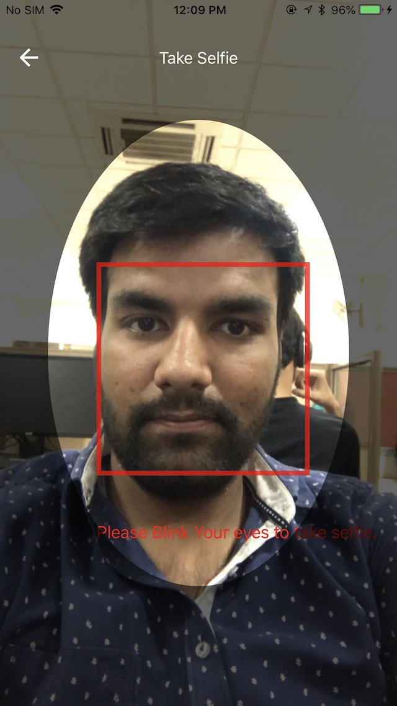

# df-selfie-check (Selfie Check SDK)

This SDK is created to automatically capture the user's selfie using the facial expression( `eye-blink` in our case). It will ensure that user have to be physically present while taking the selfie.

<b>You can achieve the functionality with easy integration of following steps:</b>

- Add the SDK to your project, don't forget to add add it in `Embedded Binaries`.

- `import SelfieCheckFramework` in your `UIViewController` file where you want to use this feature.

- And instantiate the view with following code.

        // Open view with default configuration
        let vc = SelfieCheck.sharedInstance
        vc.returnClosure = { image in

            // Play with image here
            // Code Here
            // ...

        }
        present(vc, animated: true, completion: nil)

Output would be:
 

 

  
 
 
<b>You can cutomize the color and theme of the SDK's view according to your projects user-experience.</b> 

<i>Just access the properties mentioned in the SDK. Have a look at the sample below:</i>

        let vc = SelfieCheck.sharedInstance
        
        vc.globalBGColor = #colorLiteral(red: 0.9137254902, green: 0.3921568627, blue: 0.3647058824, alpha: 1)
        vc.globalMessagesColor = UIColor.white
        vc.globalTitleColor = UIColor.white
        vc.globalButtonCornerRadius = 5
        vc.globalOptionButtonColor = #colorLiteral(red: 0.9725490196, green: 0.9725490196, blue: 0.9725490196, alpha: 1)
        vc.globalTitleOptionButtonColor = #colorLiteral(red: 0.4039215686, green: 0.7098039216, blue: 0.3647058824, alpha: 1)

        vc.navigationTitleColor = #colorLiteral(red: 0.9725490196, green: 0.9725490196, blue: 0.9725490196, alpha: 1)
        vc.navigationBarColor = #colorLiteral(red: 0.4039215686, green: 0.7098039216, blue: 0.3647058824, alpha: 1)
        
        vc.globalActioButtonColor = #colorLiteral(red: 0.4039215686, green: 0.7098039216, blue: 0.3647058824, alpha: 1)
        vc.globalTitleActionButtonColor = #colorLiteral(red: 0.9725490196, green: 0.9725490196, blue: 0.9725490196, alpha: 1)
        
        vc.globalBorderButtonColor = #colorLiteral(red: 1.0, green: 1.0, blue: 1.0, alpha: 1.0)
        vc.globalOptionBorderButtonColor = #colorLiteral(red: 0.4039215686, green: 0.7098039216, blue: 0.3647058824, alpha: 1)
        
        vc.overlayColor = #colorLiteral(red: 0, green: 0, blue: 0, alpha: 1)
        
        vc.tipGuidanceOne = "Tip : Please look straight and then blink eyes."
        vc.titlePermissionVC = "Please allow camera permission."
        vc.returnClosure = { image in
            self.selfieImageView.image = image
        }
        self.present(vc, animated: true, completion: nil)

Updated UI output would be:
 

 

  
 
  
<h2>Here are the list of all the configurable properties, you may need:</h2>

    // This property change the background colour of the guidance screen.
    public var globalBGColor: UIColor

    /** This property change the colour of the photo guidance button. */
    public var globalActioButtonColor: UIColor

    /** This property change the colour of the title of photo guidance button. */
    public var globalTitleActionButtonColor: UIColor

    /** This property change the corner radius of the photo guidance button. */
    public var globalButtonCornerRadius: CGFloat

    /** This property change the color of the cancle button, default is white */
    public var globalOptionButtonColor: UIColor

    /** This property change the colour of the title of photo guidance button. */
    public var globalTitleOptionButtonColor: UIColor

    /** This property change the color of the title of all the screens. */
    public var globalTitleColor: UIColor

    /** This property change the color of the messages of all the screens. */
    public var globalMessagesColor: UIColor

    /** This property change the color of the navigation bar. */
    public var navigationTitleColor: UIColor

    /** This property change the color of the navigation bar. */
    public var navigationBarColor: UIColor

    /** This property change the color of the border global button. */
    public var globalBorderButtonColor: UIColor

    /** This property change the color of the border global option button. */
    public var globalOptionBorderButtonColor: UIColor

    /** This property change the navigation title for first guidance view controller. */
    public var titleNavGuidanceOne: String?

    /** This property change the title message for first guidance view controller. */
    public var messageGuidanceOne: String?

    /** This property change the tip field on the first guidance view controller. */
    public var tipGuidanceOne: String?

    /** This property change the title of action button for first guidance view controller. */
    public var actionTitleGuidanceOne: String?

    /** This property change the title of cancle button for first guidance view controller. */
    public var cancleTitleGuidanceOne: String?

    /** This property change the navigation title for permission view controller. */
    public var titleNavPermissionVC: String?

    /** This property change the title for permission view controller. */
    public var titlePermissionVC: String?

    /** This property change the message for permission view controller. */
    public var messagePermissionVC: String?

    /** This property change the title of action button for permission view controller.  */
    public var actionTitlePermissionVC: String?

    /** This property change the title of cancle button for permission view controller.  */
    public var cancleTitlePermissionVC: String?

    /** This property change the title of action button for select selfie.  */
    public var actionTitleSelectSelfieVC: String?

    /** This property change the title of cancle button for permission view controller.  */
    public var cancleTitleSelectSelfieVC: String?

    /** This property changes the color for overlay view on capture-selfie screen.*/
    public var overlayColor: UIColor
    
    /** This property return the selfie image of the user. */
    public var returnClosure: ((UIImage?) -> Void)?

 
---

 
<b>More Details( Sample Code Repository):</b>

You can also take help from github repository including the working demo of `SelfieCheckFramework`.

https://github.com/anandramdeo-df/df-selfie-check
